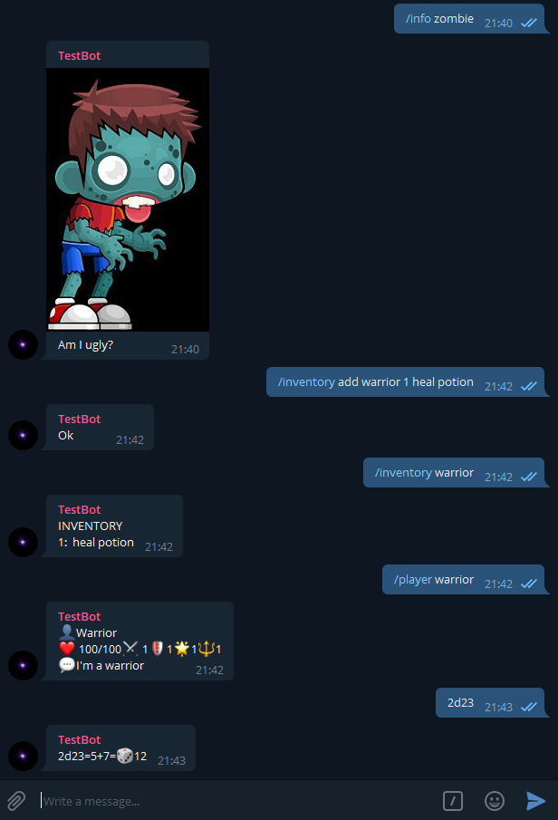

  
    
  

<h3 align="center">Rolebot</h3>

  Rolebot is a simple php bot for telegram that can be used to play role games.

 
  
## Functionality

Rolebot includes:
- Dice commands
- Send images, texts, sounds or gifs
- Manage automated fights
- Store and query players statistics
- Inventory
- Administration web

## Technologies

- Php 5 with xdebug
- [Composer](https://getcomposer.org/)
- [PHP Slim framework v3](https://www.slimframework.com/)
- [PHP Telegram Bot](https://github.com/php-telegram-bot/core)
- [Monolog](https://github.com/Seldaek/monolog)
- [Angularjs](https://angularjs.org/)
- [RedbeanPHP](https://redbeanphp.com): ORM for PHP

## Commands

- /account - show account info
- /adminfight - list fights
- /adminfight on/off fightname - enable/disable fight
- /at opponentname - attacks an opponent
- /d6 - dice
- /d20 - dice
- /fight - fight status
- /heal playername hp - heals (e.g. /heal sam 1)
- /healall hp - heal all (e.g. /healall 10)
- /hello - check
- /hit playername hp - hit a player
- /hitall hp - hit all (e.g. /healall 10)
- /info name - serve media (configured in the web)
- /inventory playername - inventory of the player
- /inventory add playername quantity object (e.g. /inventory add sam 1 heal potion) - add item(s) to the inventory
- /inventory remove playername quantity object (e.g. /inventory add sam 1 heal potion) - remove item(s) to the inventory
- /pass - pass turn
- /player - show players and npc statistics
- /player playername - show detailed player info
- Write directly <numberOfdices>D<diceSides> to throw dices (e.g. 2D20 will throw two 20-sided dices)

## Installation

1. Download code
2. Run `composer update` to get the dependencies
2. Create bot using [botfather](https://core.telegram.org/bots#6-botfather)
    - Set [privacy mode](https://core.telegram.org/bots#privacy-mode) to disabled if you want to use generic messages (allow the bot to read all messages not only the ones that start with / )
4. Copy configTemplate.php to config.php and configure your settings and bot keys
5. Create a new database and run the .sql script provided in the scripts folder
6. Upload code to a php hosting server. The project as it is is configured for apache (make sure mod_header and mod_rewrite are enabled)
7. To register the telegram web hook visit the url https://\<yourhost\>/\<pathtobot\>/telegramhook\<urlKey\>/sethook
    * urlKey is specified in the config file
8. Say /account to your bot. You should see your telegram id and you will see that you are not registered
9. Login the admin web and register some users. The telegram id is the number you get on step 8
10. Say /account to your bot. You should see that this time you are registered
11. Say */hello* to your bot. You should receive an answer with the url of the admin web
12. Enjoy!

## Other development commands

### Composer is used to load library paths (psr-4)

* Update composer files:  composer dump-autoload
* Validate composer file: composer validate

## Screenshots

## Tools

- Visual studio code
- Atom
- Ftp simple

